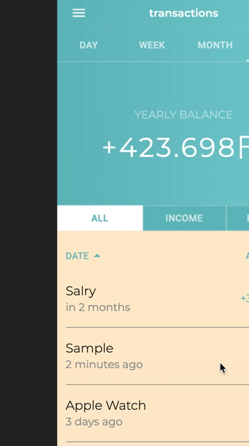
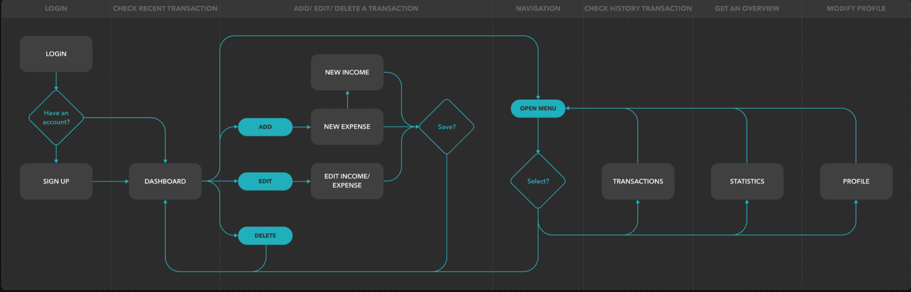
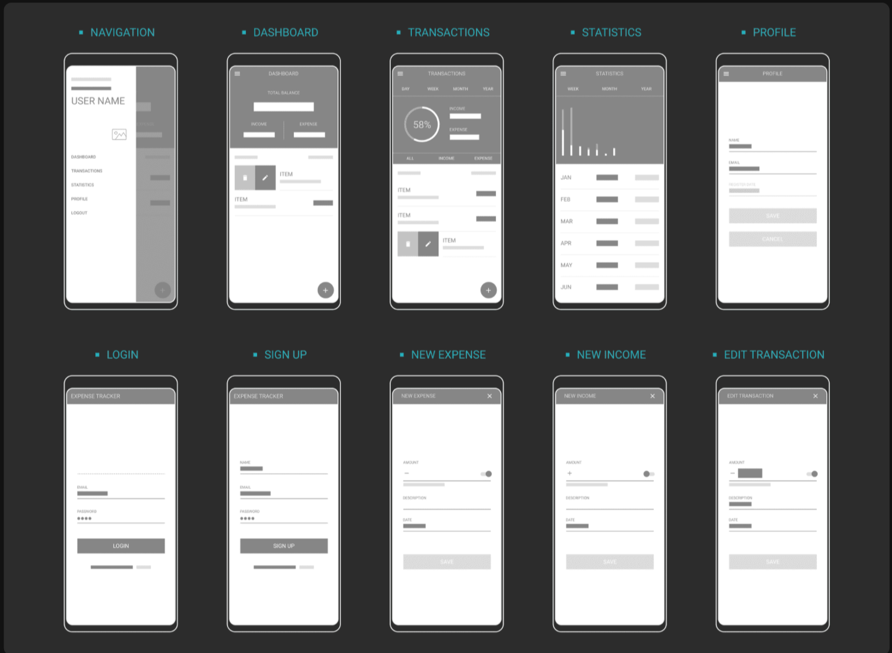
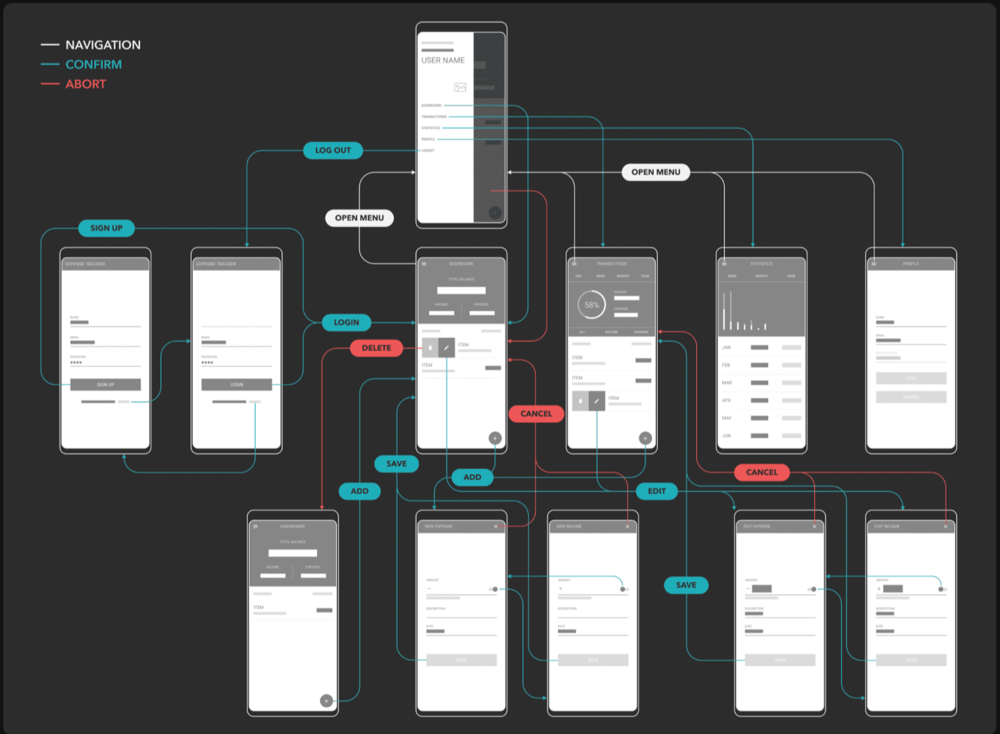

# budget-app

## Summary
This budget app aims to assist a user in managing personal money by offering not only a basic expense check but also a brief analysis of incomes and expenses. All operations are performed in privare through a personal account.

this one is a all javascript application, deployed on Heroku  

Frontend : HTML5 CSS3( Sass ), React.js
Backend : Express.js ( Node.js )
Database : MongoDB Atlas

## User Story
Logged in, the uesr can access the following key features :  

- Add / Edit / Delete a transaction : The user can create a new income or expense transaction which can be deleted or modified after the creation.

- Check recent transactions: the user will see all transactions took place in the last three days and the sum of income, expense and balance in the personal dashboard.  

- Get an overview of incomes and expenses : All transactions of the user are accumulated to the daily, weekly and total sum and viewed as a histogram ( Bar or Chart ). The user then gets a better understanding of the weekly, monthly and yearly fluctuation of incomes and expenses. 

## Views

## Wireframe

## About web development
Personal financial records are sensitive infomations, it is necessary to keep personal data in private. Therefore, user authentication was required and verified with JWT ( JSON Web Token ).
Using libraries : D3.js ( viewed transaction data ) / react-spring ( added some animations )
